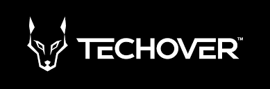

# Spotify Clone

## Vad görs denna milstolpe

-   Initiera ett nytt React projekt med **npm create vite**
-   Router Config
-   Material UI Config
-   Skapa ett nytt Spotify projekt
-   Länka spotify credentials
-   Images assets

-   [Spotify web playback sdk](https://developer.spotify.com/documentation/web-playback-sdk/reference/)
-   [Spotify web api](https://developer.spotify.com/documentation/web-api/reference/#/)
-   [Material UI](https://mui.com/material-ui/getting-started/overview/)
-   [React](https://beta.reactjs.org/)
-   [React router](https://reactrouter.com/en/main)

